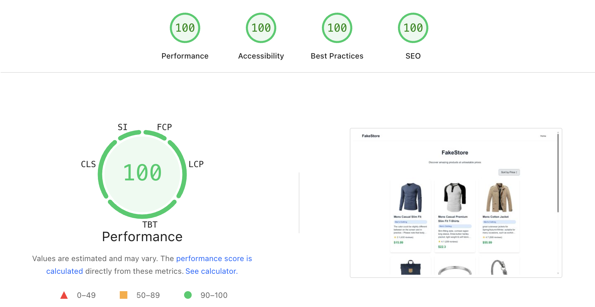

# FakeStore

[](https://nextjs.org/)
[](https://www.typescriptlang.org/)
[](https://tailwindcss.com/)
[](https://jestjs.io/)

A modern, professional e-commerce product listing application built with Next.js, featuring advanced data fetching, error handling, accessibility, and comprehensive testing. Displays curated products from the FakeStore API with intelligent sorting and caching capabilities.

## Performance

Achieving a perfect 100/100 score on Google PageSpeed Insights!



## Features

### Core Functionality
- **Dynamic Product Display**: Renders product cards with images, titles, categories, descriptions, ratings, and prices
- **Advanced Sorting**: Price-based sorting with ascending/descending toggle, optimized with memoization
- **Intelligent Data Fetching**: SWR-powered caching with automatic retries and background revalidation
- **Error Handling**: Comprehensive error boundaries and user-friendly error states with retry mechanisms
- **Professional Loading States**: Skeleton loaders for smooth user experience during data fetching

### User Experience & Accessibility
- **Fully Responsive Design**: Optimized layouts for desktop, tablet, and mobile devices
- **Accessibility First**: ARIA labels, roles, keyboard navigation, and screen reader support
- **Image Optimization**: Next.js Image component with lazy loading and responsive sizing
- **Interactive UI**: Hover effects, transitions, and disabled states for better feedback

### Developer Experience
- **TypeScript Integration**: Fully typed codebase with strict type checking
- **Service Layer Architecture**: Separated API logic for maintainability and testability
- **Comprehensive Testing**: Unit tests with Jest and React Testing Library
- **Bundle Analysis**: Webpack bundle analyzer for performance monitoring
- **ESLint Integration**: Code quality enforcement and consistency

## Tech Stack

- **Framework**: Next.js 16 (App Router)
- **Language**: TypeScript 5
- **Styling**: Tailwind CSS 4
- **State Management**: SWR (for data fetching and caching)
- **Testing**: Jest + React Testing Library
- **Build Tools**: Webpack (via Next.js)
- **Package Manager**: pnpm
- **API**: FakeStore API (https://fakestoreapi.com)

## Getting Started

### Prerequisites

- Node.js 18 or later
- pnpm (recommended) or npm/yarn

### Installation

1. Clone the repository:
```bash
git clone <repository-url>
cd product
```

2. Install dependencies:
```bash
pnpm install
# or
npm install
# or
yarn install
```

3. Run the development server:
```bash
pnpm dev
# or
npm run dev
# or
yarn dev
```

4. Open [http://localhost:3000](http://localhost:3000) in your browser.

## Usage

### User Experience
- Browse the professionally designed product grid on the homepage
- Sort products by price using the accessible toggle button (ascending/descending)
- Experience smooth loading states with skeleton placeholders
- Encounter robust error handling with retry options for network issues

### Accessibility
- Fully keyboard navigable with proper ARIA labels
- Screen reader compatible with semantic HTML and roles
- High contrast ratios and readable typography

## Project Structure

```
├── app/
│   ├── api/
│   │   └── products/
│   │       └── route.ts             # API route to proxy FakeStore API requests
│   ├── page.tsx                    # Main application page with error boundary
│   └── layout.tsx                  # Root layout component
├── components/
│   ├── ProductList.tsx             # Main product listing component with SWR integration
│   ├── ProductCard.tsx             # Individual product card component
│   └── ErrorBoundary.tsx           # Error boundary for crash handling
├── services/
│   └── productService.ts           # API service layer with TypeScript interfaces
├── __tests__/
│   └── ProductList.test.tsx        # Comprehensive unit tests
├── next.config.ts                  # Next.js configuration with bundle analyzer
├── jest.config.js                  # Jest testing configuration
├── jest.setup.js                   # Jest setup for testing utilities
├── package.json                    # Dependencies and scripts
├── tailwind.config.js              # Tailwind CSS configuration
├── tsconfig.json                   # TypeScript configuration
└── README.md                       # This documentation
```

## API Reference

The app uses the [FakeStore API](https://fakestoreapi.com/docs) to fetch product data via a proxied endpoint to avoid CORS issues:

- **Local Endpoint**: `/api/products` (proxies to `https://fakestoreapi.com/products?limit=6`)
- **Response**: Array of product objects containing:
  - `id`: Unique product identifier
  - `title`: Product name
  - `price`: Product price in USD
  - `image`: Product image URL
  - `category`: Product category
  - `description`: Detailed product description
  - `rating`: Object with `rate` (1-5) and `count` (review count)

## Development

### Available Scripts

- `pnpm dev` - Start the development server with hot reloading
- `pnpm build` - Create optimized production build
- `pnpm start` - Start the production server
- `pnpm lint` - Run ESLint for code quality checks
- `pnpm test` - Run Jest unit tests
- `pnpm test:watch` - Run tests in watch mode

### Bundle Analysis

To analyze bundle sizes:
```bash
ANALYZE=true pnpm run build -- --webpack
```
This generates interactive bundle reports in `.next/analyze/`

### Testing

The project includes comprehensive unit tests covering:
- Component rendering and state management
- User interactions and accessibility
- Error handling and loading states
- Data fetching with mocked SWR

Run tests with `pnpm test` to ensure code reliability.

## Contributing

1. Fork the repository
2. Create a feature branch
3. Make your changes
4. Run tests and linting
5. Submit a pull request

## License

This project is open source and available under the [MIT License](LICENSE).

## Performance & Best Practices

This project demonstrates enterprise-level React development with:
- **Performance Optimization**: Memoization, efficient re-renders, and optimized images
- **Type Safety**: Comprehensive TypeScript usage throughout
- **Testing Strategy**: Unit tests ensuring reliability and maintainability
- **Accessibility**: WCAG compliant with screen reader support
- **Error Resilience**: Graceful error handling and recovery mechanisms
- **Code Quality**: ESLint, formatting, and clean architecture

## Acknowledgments

- [FakeStore API](https://fakestoreapi.com) for providing sample product data
- [Next.js](https://nextjs.org) for the excellent React framework and App Router
- [Tailwind CSS](https://tailwindcss.com) for utility-first styling
- [SWR](https://swr.vercel.app) for powerful data fetching and caching
- [Jest](https://jestjs.io) and [React Testing Library](https://testing-library.com/docs/react-testing-library/intro/) for robust testing
- [TypeScript](https://www.typescriptlang.org) for type safety and better DX
